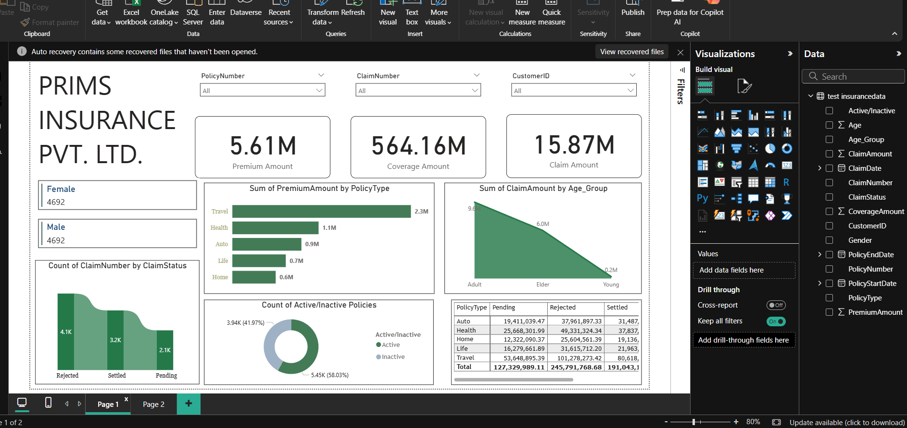

# 🏢 Insurance Data Analysis Dashboard

## 📌 Project Overview
This project focuses on analyzing insurance data to extract meaningful insights related to policies, claims, and customer behavior.  
An interactive dashboard has been created using Power BI to visualize key metrics and support business decision-making.

---

## 🎯 Objective
- Analyze customer insurance data
- Track claim and premium trends
- Identify active vs inactive policies
- Understand claim distribution across demographics

---

## 🛠️ Tools & Technologies
- Power BI
- SQL
- Python (for data processing)
- Excel / CSV Dataset

---

## 📊 Dashboard Features

### 🔹 Key KPIs
- **Total Premium Amount:** 5.61M  
- **Total Coverage Amount:** 564.16M  
- **Total Claim Amount:** 15.87M  

---

### 🔹 Visualizations Included
- 📊 Premium Amount by Policy Type  
- 📈 Claim Amount by Age Group  
- 📉 Claim Status (Rejected, Settled, Pending)  
- 🥧 Active vs Inactive Policies  
- 👥 Gender-wise Analysis  
- 📋 Detailed Table (Policy Type vs Claims)

---

## 🔍 Insights
- Travel insurance generates the highest premium revenue  
- Adults contribute the highest claim amount  
- A significant number of claims are rejected  
- Majority of policies are active  

---

## 🧩 Project Workflow
1. Data Collection (CSV / Database)  
2. Data Cleaning using Python / SQL  
3. Data Transformation in Power BI  
4. Dashboard Creation  
5. Insights & Reporting  

---

## 📷 Dashboard Preview

---

## 🚀 How to Use
1. Download the `.pbix` file  
2. Open in Power BI Desktop  
3. Refresh data if needed  
4. Interact with filters and visuals  

---

## 📁 Project Files
- `customer_shopping_behavior.csv` → Dataset  
- `customer_behavior_sql_queries.sql` → SQL queries  
- `customer_behavior_dashboard.pbix` → Power BI Dashboard  
- `README.md` → Project Documentation  

---

## 🙌 Conclusion
This project demonstrates how data visualization tools like Power BI can be used to analyze insurance data and generate actionable insights for business growth.

---

## ⭐ Author
**Sonu Kumar**
